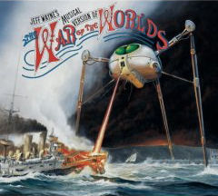

+++
title = "Det finns inget som heter science fiction-musik"
slug = "det_finns_inget_som_heter_science_fiction_musik"
date = 2008-02-18

[taxonomies]
forfattare = ["Anglemark"]
kategorier = ["Kåserier"]
taggar = ["Jeff Wayne", "musik"]
+++

Det är väldigt vanligt att sf- och fantasydiggare pratar om sf-musik och
fantasymusik, med vilket de verkar mena något slags symfonisk rock eller
hårdrock respektive svartmetall. Möjligen medeltidsliknande ballader om troll
eller skäggiga krigare. Jag är en smula allergisk mot detta. Fantasy och sf
är former av fiktion, berättelser som skildrar något som är tekniskt omöjligt
för att vår vetenskap inte kommit på hur man gör, respektive något som är
bryter mot våra naturlagar - magi och så vidare. Musikstycken, däremot,
bryter inte mot våra naturlagar eller är tekniskt omöjliga. Inte heller är de
berättelser om sådant.

Vad folk verkar mena med sf- eller fantasymusik är stämningsmusik som de
personligen associerar med sf eller fantasy, antingen för att musiksmaken
ingår som en del av en ungdomskultur som även innefattar rollspel eller
fantasy eller sf, eller för att musikerna använder sig av sf och fantasymotiv
på skivomslagen. Men det är ett nonsenssätt att se på det hela. Det som är
fantasymusik för den ene är det inte för den andre.

Musik är en konstform som inte berättar något, med väldigt få undantag. Visst
_säger_ den något, _uttrycker_ något. Men den är inte narrativ. Det finns
inte deckarmusik, det finns inte spionmusik. Det finns religiös musik, men
det beror på att religion är ett budskap. Musik kan självklart uttrycka
budskap - den är till och med bra på det. Men sf och fantasy är berättelser,
inte budskap.

De få undantagen är musik som verkligen utgör en sf-berättelse, som Jeff
Waynes _War of the Worlds_. Men dessa undantag är ytterst sällsynta och är
väsensskilda från metallband som har en drake på omslaget och kallar en av
sina låtar för _Smaug_ och genast hyllas som skapare av fantasymusik.

Bah, säger jag. Sf och fantasy är berättelser, inte stämningar.
