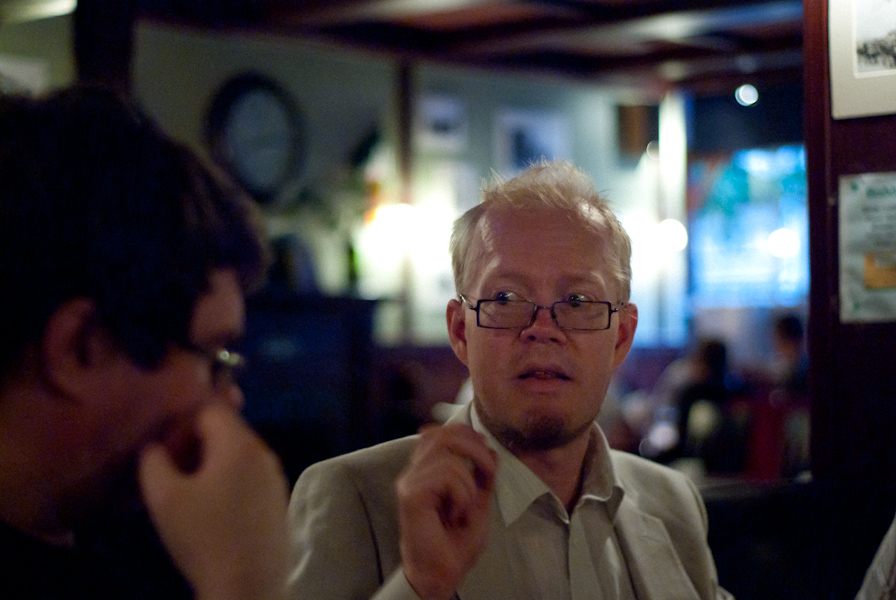
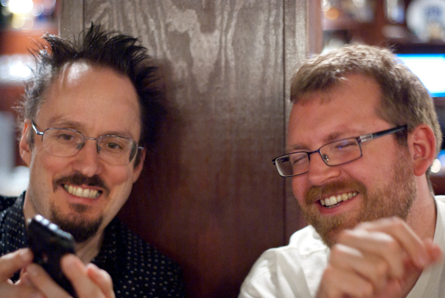
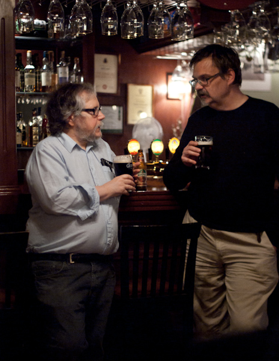
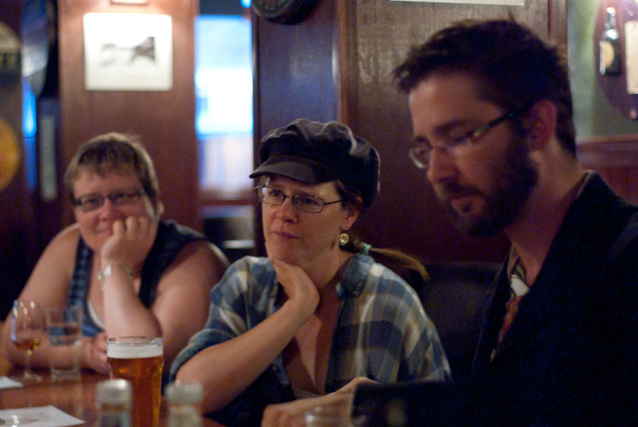
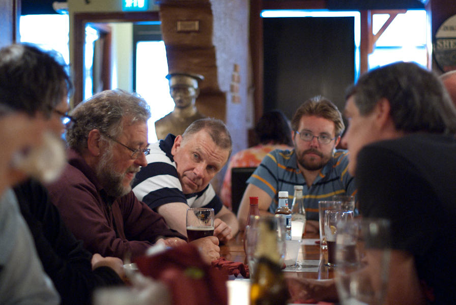
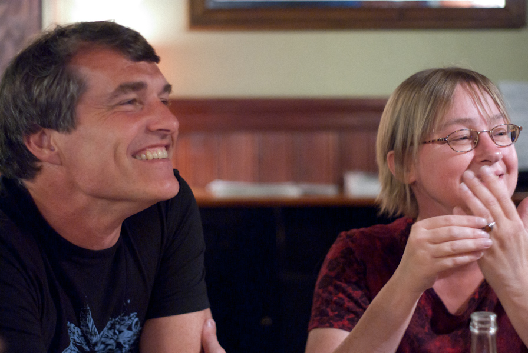

+++
title = "Julimöte på Buddy's"
slug = "julimote_pa_buddys"
date = 2010-07-08

[taxonomies]
forfattare = ["Björn"]
kategorier = ["Rapporter"]
taggar = ["pubmöten"]
+++

I tisdags möttes Upsalafandom på min kvarterskrog Buddy's, ett fall av omväxling förorsakat av sommaren. Bland samtalsämnena märktes kärnkraft, förlossningar och allmän livsleda. Jag och Magnus pratade också om våra kära kameror en god stund. Och jag använde min lite:

<!-- more -->

