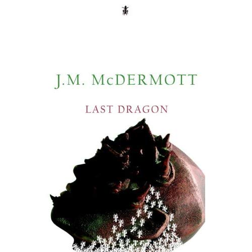
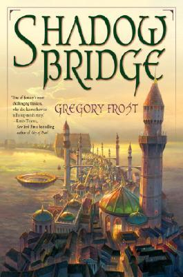
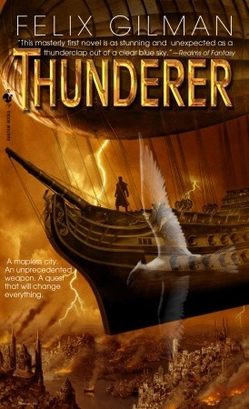

+++
title = "Några nya böcker"
slug = "nagra_nya_bocker"
date = 2008-02-17

[taxonomies]
forfattare = ["Jesper"]
kategorier = ["Nyheter"]
taggar = ["böcker", "fantasy"]
+++

Det här är mitt första bidrag till Upsalafandoms blogg och jag tänkte använda det till att tipsa om några nyutgivna fantasyböcker som har fått en hel del uppmärksamhet ute i bloggosfären.

Den första är _[Last Dragon](https://www.amazon.com/Last-Dragon-Discoveries-J-M-Mcdermott/dp/0786948574)_ av J. M. McDermott. McDermotts första roman är utgiven på Wizard of the Coasts nya etikett _Discoveries_, som är ämnad för ny fantasylitteratur som inte hör ihop med deras rollspelsvärldar. Han hade turen, eller oturen, att bli jämförd med både Gabriel Garcia Marquez och Gene Wolfe i press-releasen som förlaget skickade ut, vilket visserligen gjorde att jag fick upp ögonen för boken, men samtidigt skapade förväntningar som är ytterst svåra att leva upp till.

McDermott har [sagt](http://charles-tan.blogspot.com/2008/01/feature-interview-with-jm-mcdermott.html) att hans mål med _Last Dragon_ var att skriva en stor episk fantasyserie i en en enda volym, genom att använda olika "litterära och postmoderna tekniker", något som tydligast verkar göra sig gällande i att han avstår från ett linjärt berättande och istället låter världen och berättelse träda fram i brottstycken och vinjetter. Detta låter som ett väldigt ambitiös och vågat projekt som antingen skulle kunna bli mycket intressant eller alldeles oläsligt, men utifrån de flesta recensioner jag stött på låter det som om McDermott faktiskt har lyckats. Jeff VanderMeer [frågar sig](http://www.jeffvandermeer.com/2008/01/21/last-dragon-by-jm-mcdermott-best-first-novel-of-the-year-or-just-one-of-the-best-period) om vi i denna bok redan har fått årets bästa debutroman, Paul Witcover [prisar](http://www.scifi.com/sfw/books/sfw18134.html) McDermotts skickliga hantlag och originalitet och [OF Blog of the Fallen](http://ofblog.blogspot.com/2008/02/jm-mcdermott-last-dragon.html) framhäver författarens ekonomiska berättarstil.

Personligen tycker jag detta låter som en av de mest intressanta fantasyböcker som jag stött på på länge och den redan beställd och på väg hem med posten. Med lite tur kanske jag till och med kommer hinna läsa och recensera den inom en inte allt för avlägsen framtid.

Den andra boken jag hade tänkt skriva om är Gregory Frosts _[Shadowbridge](https://www.amazon.com/Shadowbridge-Gregory-Frost/dp/0345497589)_. Denna bok är del ett av två i en serie och utspelar sig på ett oändligt nät av broar, som korsar en ocean utan stränder. Huvudpersonen är en dockmakare och historieberättare och tillhör ett resande dockteatersällskap. Världen skildras genom deras resor och de berättelser och skådespel de framför, vilket verkar skapa en Tusen och en natt-liknande väv av berättelser, myter och skådespel.

Även denna bok har lyckats samla på sig en mängd positiva recensioner. [FantasyBookSpot](http://www.fantasybookspot.com/node/2233) gillar den och även [OF Blog of the Fallen](http://ofblog.blogspot.com/2008/01/gregory-frost-shadowbridge.html) är positiv och framhåller bokens komplexa berättarstil. Dock nöjde sig inte [John Clute](http://www.scifi.com/sfw/books/column/sfw17975.html) med att såga den, utan valde att [ge sig på alla ungdomsböcker](http://antickmusings.blogspot.com/2008/01/great-whomping-load-of-condescension.html) när han ändå var i farten.

Det kan också påpekas att både _Shadowbridge _och _Last Dragon_ är paperbackoriginal, vilket gör att den ekonomiskt lagde inte behöver vänta på en billigare utgåva.

Den sista boken för idag är också den en debutroman: _[Thunderer](https://www.amazon.com/Thunderer-Felix-Gilman/dp/0553806769)_ av Felix Gilman. _Thunderer _verkar ansluta sig till New Weird-genren, där författare som China Mièville och Jeff VanderMeer är de stora namnen och i likhet med dessa herrars böcker utspelar sig Gilmans roman i en stor stad fylld med bisarra företeelser och varelser. Här blir en ung musiker indragen i en maktkamp mellan några av staden Ararats oändliga gudar.

Går man efter vad som skrivits på nätet om boken verkar Gilman vara en skicklig författare och en god stilist. [Paul Di Filippo](http://www.scifi.com/sfw/books/sfw18034.html) berömmer honom för hans fantasi och jämför boken med Mark Helprins ypperliga _Winter's Tale_ och [Fantasy Book Critic](http://fantasybookcritic.blogspot.com/2007/12/thunderer-by-felix-gilman.html) håller i stort sett med. Författaren har själv samlat en mängd recensioner på sin egen [hemsida](http://felixgilman.com/books.html).

Dessa är de tre fantasyromaner som verkar mest intressanta av allt som hittills givits ut under 2008 och jag kommer även forsättningsvis försöka hålla koll på nya böcker som kan tänkas vara av särskilt intresse. Då kommer jag nog dock att försöka vara lite mer kortfattad än i den här artikeln, som jag nu märker blev längre än vad jag hade tänkt mig.
