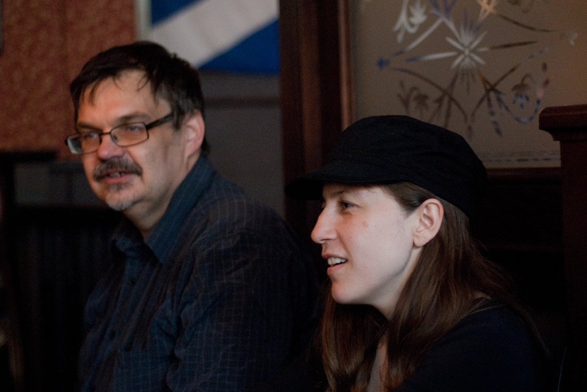
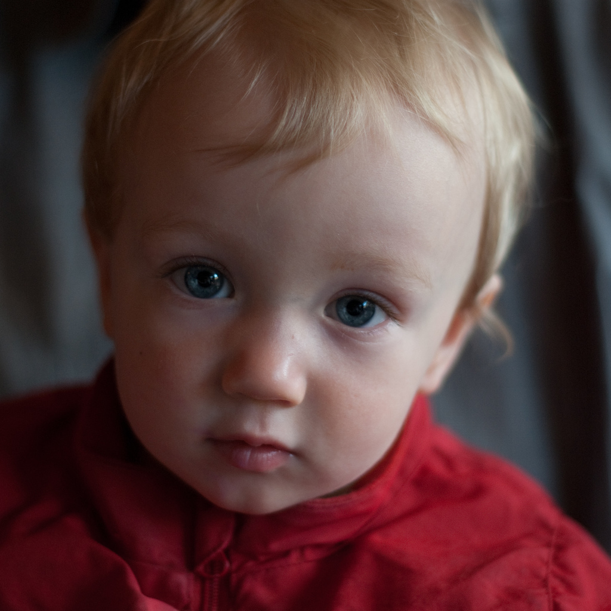
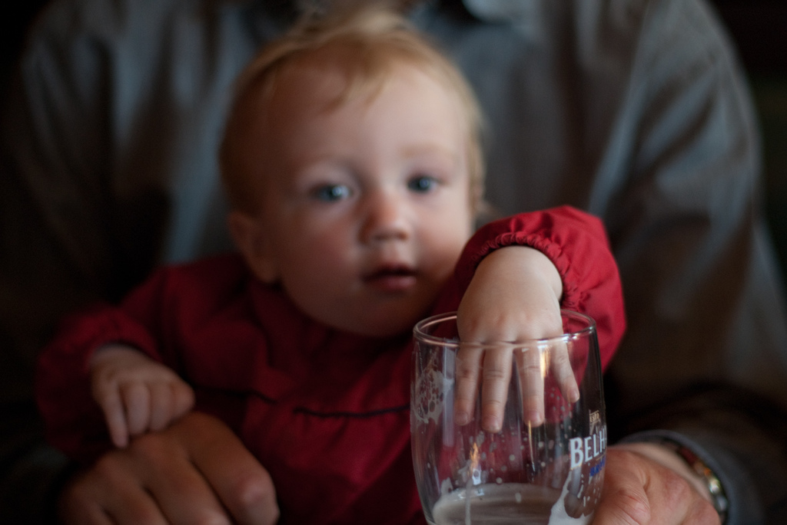
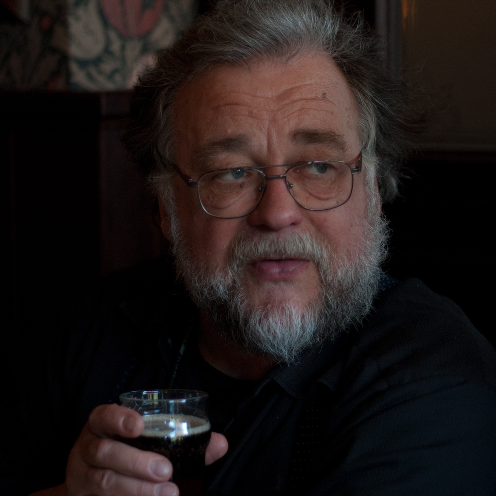
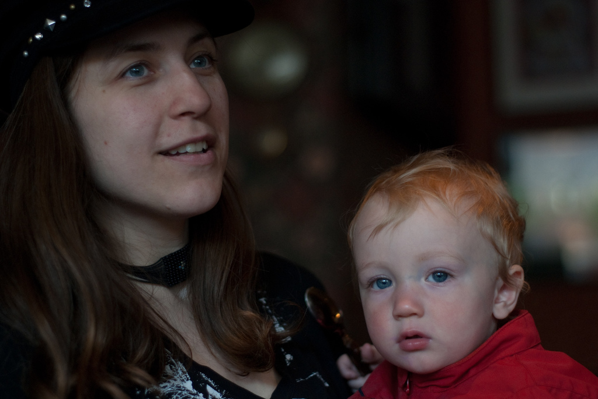
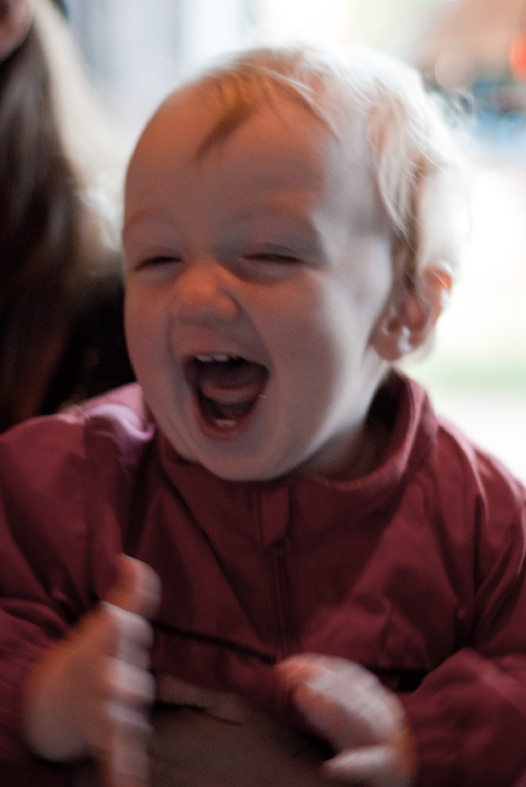
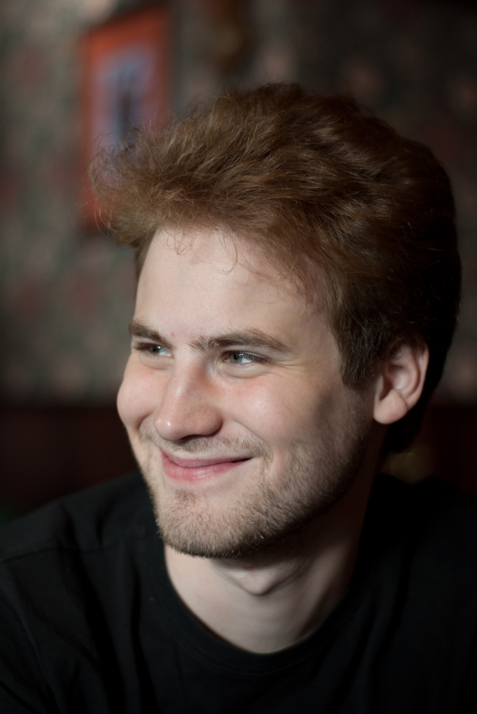
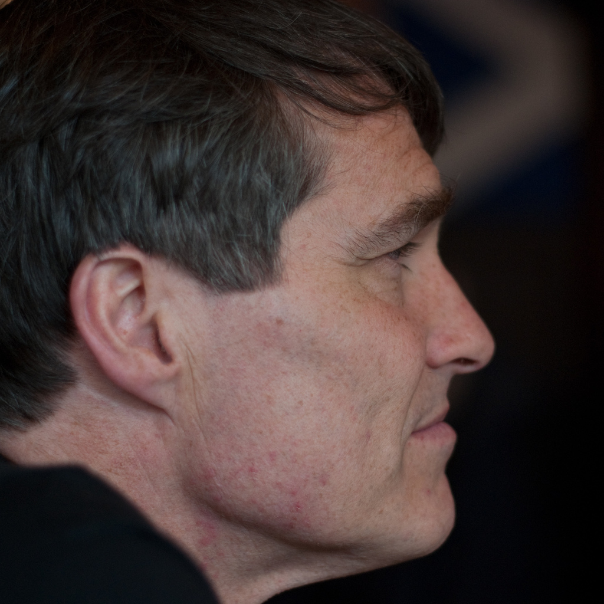

+++
title = "Tisdag 1 juni 2010"
slug = "tisdag_1_juni_2010"
date = 2010-06-02

[taxonomies]
forfattare = ["Björn"]
kategorier = ["Rapporter"]
taggar = ["foto", "pubmöten"]
+++

Jag stannade inte så länge på pubmötet igår kväll, men jag hann åtminstone lägga ut texten om batteriers hållbarhet och vinpriser, och knäppa några bilder.

<!-- more -->

