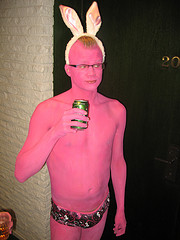

+++
title = "Upsalafandom på Williams, kapitel 137"
slug = "upsalafandom_pa_williams_kapitel_137"
date = 2008-05-05

[taxonomies]
forfattare = ["Anglemark"]
kategorier = ["Inbjudningar"]
+++

Detta har hänt: Upsalafandom har inrättat en serie sammankomster på värdshus
för att diskutera gårdagens händelser, dagens aktualiteter och framtidens
möjligheter. Mattias, Ollie och Nicklas har stupat och Ante och Åka finner
sig för ögonblicket oförmögna att närvara, men nya hjältar har tagit deras
platser. Kampen går vidare.

Under morgondagen kommer rapport att avges från [Åcon
2](https://acon2.wordpress.com), som avhölls i Mariehamn i helgen. Kom och hör
berättas om hur [Ilja målades
chockrosa](https://www.flickr.com/photos/jophan/sets/72157604891888270) och om
Ahrvids våldsamma magsjuka, om festen som slutade klockan åtta på morgonen
och om Saris extremt ovetenskapliga och påstridiga litania om vad som är rätt
och riktigt, för att inte tala om fel och korkat med sf och fandom.

J. Jönsson kommer att förklara hur man beter sig för att bli medlem av [Åcon
3](https://acon3.wordpress.com) som går av stapeln nästa år och ta emot
nomineringar till NoFF. Han kan även förklara vad NoFF är, för den som inte
vet det. Vidare kommer besök på [Swecon](https://www.lysator.liu.se/confuse) i
Linköping och [Finncon](http://2008.finncon.org/en/index.htm) i Tammerfors
att diskuteras.

Till dessa muntrationer kommer öhl att drickas och bhojee vindabonna att
förtäras i rikliga mängder.
