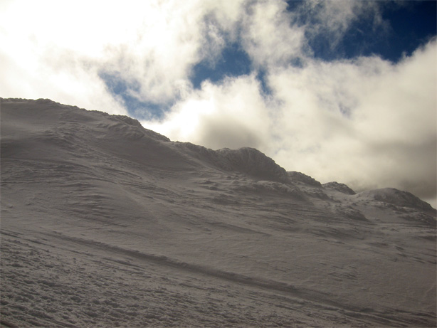
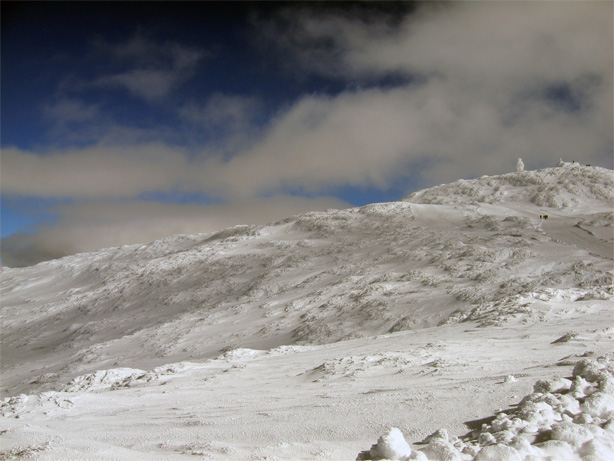
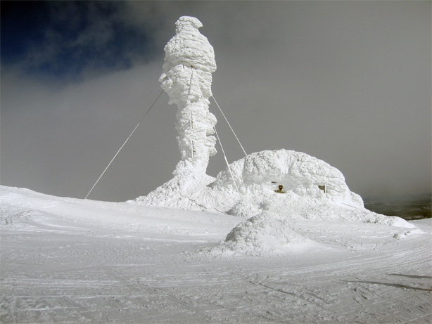
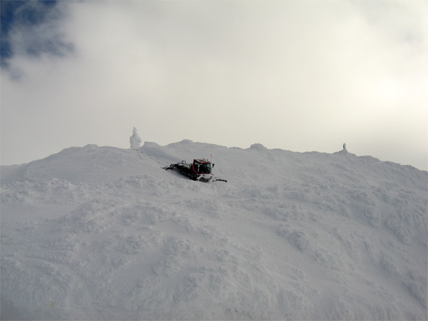
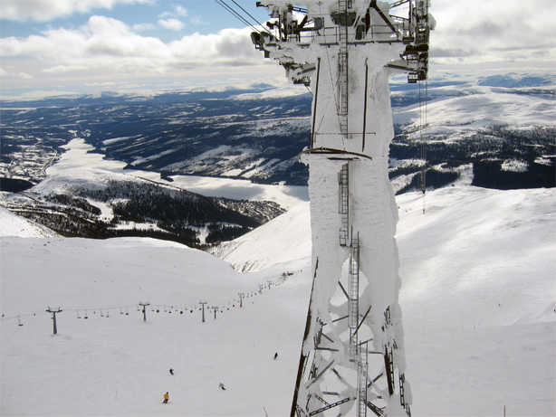

+++
title = "White Mars"
slug = "white_mars"
date = 2008-04-07

[taxonomies]
forfattare = ["Anglemark"]
kategorier = ["Kåserier"]
taggar = ["Mars", "rymdexpeditioner", "Åre"]
+++

Jag är just återkommen från några dagar i Åre, och när jag befann mig uppe på
Åreskutan så begrep jag mycket väl varför så många forskare och sf-författare
drar paralleller mellan de vita vidderna vid polerna och förhållandena på
Mars. (Det begrep jag i och för sig innan med, men det levandegjordes på ett
suveränt sätt däruppe.)

Själva landskapet liknar Mars stenöknar, med undantag för färgen. Och det
finns väldigt lite i civilisationsväg, man känner sig helt utlämnad till den
karga, kala naturen.

Toppstugan uppe på Åreskutan var helt igensnöad och masten liknade mest en
vittrad rauk.

En pistmaskin som tog sig ned mot kabinstationen liknade en stor och tung
självgående maskin som landsatts av Marsexpeditionen.

Själva kabinbanan, med dess gigantiska torn, vagnar och dockningsstationer
kändes väldigt sciencefictioniga. En korsning mellan isplaneten Hoth och
Firefly.

