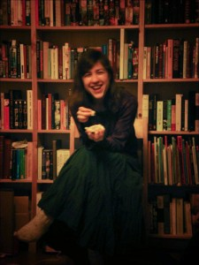

+++
title = "Bokprat"
path = "bokprat"
+++

En gång i månaden träffas vi hemma hos någon för att diskutera en bok och
dricka té. Det är oftast en science fiction- eller fantasybok, men det har
förekommit de flesta sorters litteratur under åren.

Vanligtvis bestämmer vi vilka böcker vi ska läsa terminsvis på ett
planeringsmöte och vi har då ett tema som vi väljer utifrån. Ett sådant tema
kan variera från allt mellan [Nebula Award](http://en.wikipedia.org/wiki/Nebula_Award)-vinnare
till "en valfri bok jag tycker vi borde läsa och diskutera".

Den nuvarande läslistan och en förteckning på gångna bokprat finns på
[Bokpratsteman](./sidor/bokpratsteman.md).
