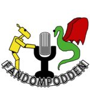

+++
title = "Podradio"
path = "podradio"
+++

# Fandompodden

[Fandompodden](https://fandompodden.podbean.com/) är en fannisk stafettpodcast där lokala grupper turas om att sända. Upsalafandom har varit med ett par gånger:

* [#4, Reflektioner från en rymdstation](http://fandompodden.podbean.com/e/fandompodden-004-stockholmuppsala-reflektioner-fran-en-rymdstation/), i vilket några personer från Upsala och Stockholm som brukar synas på våra pubmöten pratar om lite av varje.

* [#7, Nobelpriset och Alvarfonden](http://fandompodden.podbean.com/e/fandompodden-007-vasterasuppsala-nobelpriset-och-alvarfonden/), i vilket Johan får besök från Västerås och visar hur Alvarfondens antikvariat ser ut när det inte är kongress.

# Gårdagens värld idag igen

[Gårdangens värld idag igen](https://annien.wordpress.com/category/gardagens-varld-idag-igen/), ett fanzine i ljudform av Ante och Åka.
