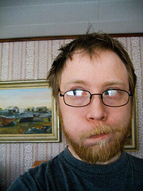
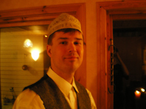
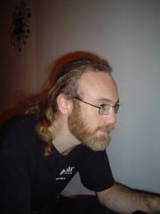
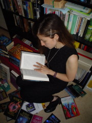
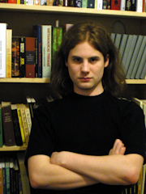
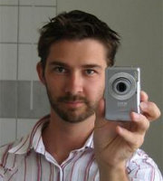
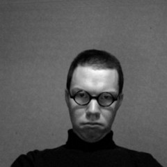
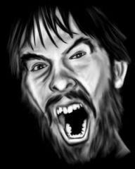
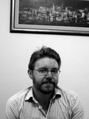

+++
title = "Vilka är vi?"
path = "vilka_ar_vi"
+++

Här är några av de som skrivit på den här sidan och utgör en del av
[fandom](./sidor/vad_ar_fandom.md) i Uppsala, eller med ett annat ord Upsalafandom.
 

[Nicklas Andersson](https://www.instagram.com/nyvinter/) är en upsalafan i
exil. Trots hans omständigheter har vi honom att tacka för designen av den
här sidan.
 

**Johan Anglemark** är navet i den Upsaliensiska pubmötestraditionen och ordförande för Alvarfonden. Han är även känd statsman och president i [ett av världens minsta länder](https://talossa.com/).

**Andreas Davour** har en historia som fanzineredaktör av det mer experimentella slaget. Han tycker om hårdrock och gamla datorer.

[Anna "Åka" Davour](https://annien.wordpress.com/) är en av Upsalas mest
produktiva fanzineredaktörer. Hon är också händig med strålar.

Alvarpristagaren **Johan Jönsson** har ett järn i de flesta eldar,
huvudsakligen på [Catahya](https://www.catahya.net) och i nättidskriften
[Vetsaga](https://vetsaga.se/).

**Torbjörn Josefsson** tycker om spel, helst tyska, och gör ibland egna som
man kan hitta på hans hemsida.

[Björn Lindström](https://elektrubadur.se/) kom in i Upsalafandom i slutet av
90-talet. Han är en annan exil-upsalafan, och ansvarig för det tekniska med
den här hemsidan.

**Gabriel Nilsson** är mänsklighetens svar på en miljon apor med lika många
skrivmaskiner. När han inte producerar textmassor försöker han bli den förste
efter Leibniz att behärska alla kända vetenskaper.

**Jesper Svedberg** fiskades upp via författarlistan SKRIVA (numera
[Korkek](https://lists.lysator.liu.se/mailman/listinfo/korkek)) och är en
påläst jäkel när det gäller författare och böcker.
